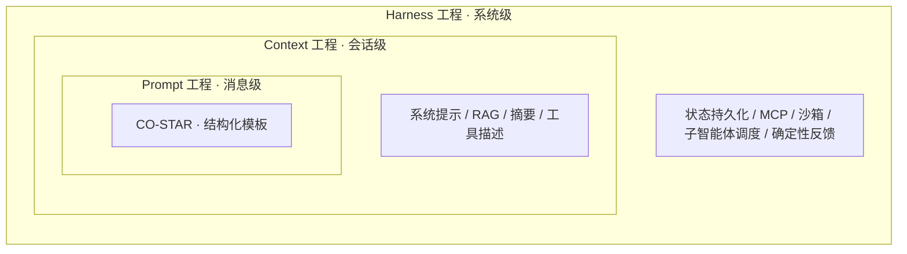
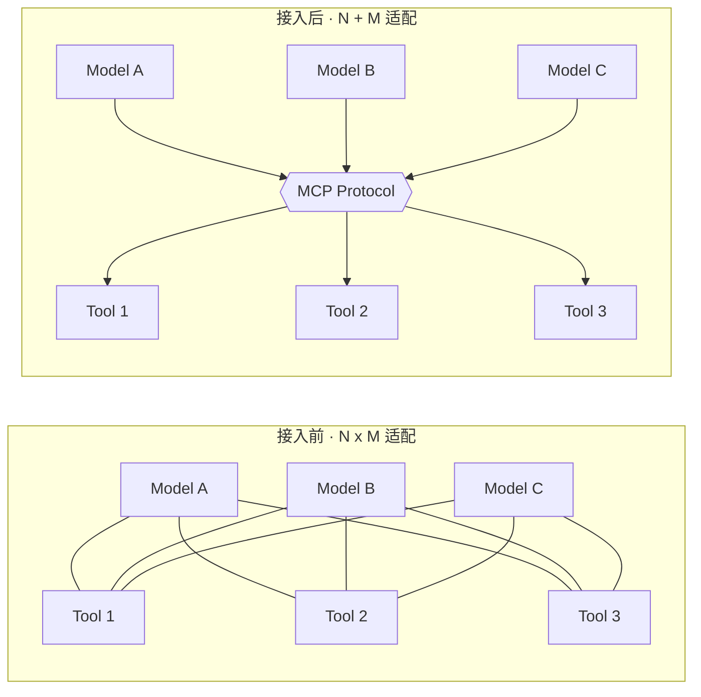
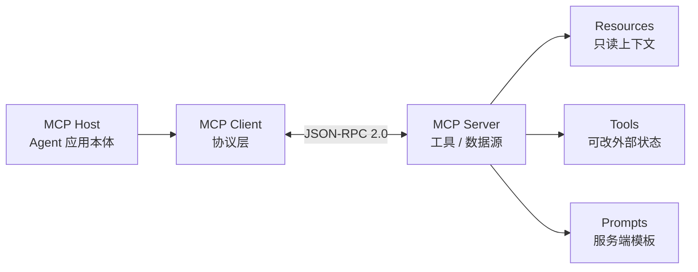
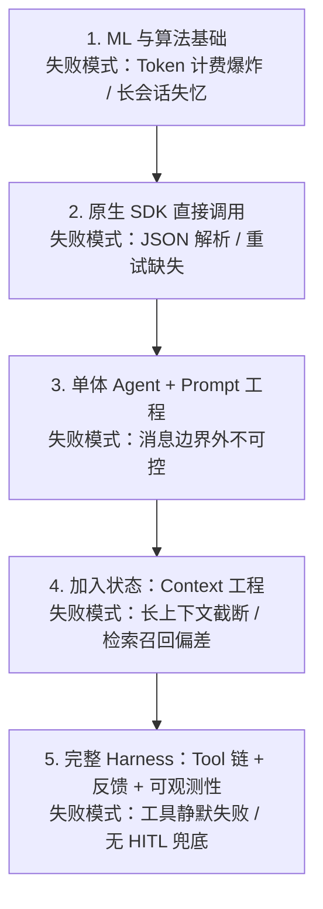

过去一年我跟了几个 Agent 项目，反复看到同一个模式：团队把精力压在模型选型与提示词花样上，真正决定生产环境可靠性的却是 Harness——也就是模型之外那套控制循环。模型像电机，Harness 像车架；电机型号决定上限，车架决定能不能开上路。

这篇文章把我观察到的脉络整理成一份从零到一的路线：先讲 LLM 的几条工程相关的底层属性，再拆 Agent 的四类设计模式，然后说明 MCP、多智能体、框架选型、评测可观测性各解决哪一类问题，最后给出按 Prompt -> Context -> Harness 三层递进的学习顺序。

## Agent 是怎么走到今天的

理解一项工程实践之前，先看它有哪些被否决的前身，这能让后续的设计权衡有参照。Agent 这个词的内涵在过去三十年里至少换过两次。

第一阶段是**基于规则的文本系统**。1966 年的 ELIZA 通过模式匹配模拟心理治疗师，能处理的输入完全在脚本之内，离开脚本即崩溃。

第二阶段是 **LLM 直接对话**。2022 年 11 月 ChatGPT 发布后，模型本身已能处理开放语义，但默认形态是"被问才答"——没有持续的环境感知、没有跨轮记忆、没有自发规划。

第三阶段才出现真正可执行环境任务的 Agent。两个 2023 年的工作把行业认知推到了这一步：

- **Generative Agents（Smallville 小镇）**：斯坦福用 LLM + 记忆流 + 反思机制在沙盒里模拟了一组具有可信社交行为的角色，证明"记忆 + 反思"两个机制能让多个 LLM 实例之间出现协作模式。该工作未在真实开放世界验证，仅限沙盒。
- **Voyager（Minecraft）**：首个 LLM 驱动的终身学习 Agent，通过自动课程 + 可执行代码技能库（Skill Library），在不微调模型的情况下持续扩展能力。Voyager 的迁移性建立在 Minecraft 的封闭动作空间之上，离开该环境效果会显著降级。

## LLM 有哪些会影响 Agent 设计的底层属性

要把 LLM 当成可靠组件嵌进系统，需要先看清它的边界条件。这一节只讲对 Agent 工程直接相关的几条。

LLM 的输入输出都以 Token（词元）为单位，Token 是字符序列的离散数值表示，决定了语义粒度和计费口径。模型一次能处理的最大 Token 数叫**上下文窗口**（Context Window），这是 Agent 短期工作记忆的硬上限——任何长会话的"记忆"都必须靠外部机制承接，模型自身做不到。

生成阶段两个采样参数对 Agent 行为最敏感：温度（Temperature）和 Top-P。温度越低、概率分布越平，输出越接近确定行为；执行工具调用、生成 JSON 这类要求格式严格的场景应使用接近 0 的温度，否则会偶发格式破损导致整轮失败。

模型的训练分三阶段：预训练学习语言的统计分布；监督微调（SFT）让模型学会"按指令回答"；对齐阶段则让模型对齐人类偏好。传统 RLHF 路线先训一个奖励模型再用 PPO 优化，依赖较大算力。直接偏好优化（DPO）把偏好信号隐式融入策略，省掉了独立奖励模型，在小规模与本地化训练中更稳；但 DPO 在偏好数据稀疏或冲突严重时仍会产生策略漂移，并非任何场景都优于 PPO。

## Prompt、Context、Harness 是什么关系

2026 年业界已有一个被反复使用的等式：**Agent = 模型 + Harness**。在这个等式里，输入控制不再是单一变量，而被拆成三层抽象，分别处理消息、会话、系统三个尺度。

**提示词工程（Prompt Engineering）** 处理消息级输入。CO-STAR 这类结构化框架（Context、Objective、Style、Tone、Audience、Response）让"写一段提示"从手感活变成可复用的模板，输出一致性可量化。它的边界很清楚：单条消息内有效，跨多轮会话或多步推理时单靠 Prompt 无法保证状态。

**上下文工程（Context Engineering）** 处理会话级输入，决定模型在推理前能看到哪些信息：系统提示、RAG 检索结果、对话压缩摘要、可用工具描述、当前时间。一个常见的失败模式是不做裁剪直接拼接，导致 Token 接近上限后早期信息被截断或被自动摘要稀释；解决方式是按任务类型拆 sub-agent 分流。这一层做不好，模型会在长对话中"忘掉"前面的约束。

**Harness 工程** 处理系统级运行环境，决定模型之外那套循环长什么样：状态持久化、工具与 MCP 接入、沙箱与浏览器、子智能体调度、Linter / 类型检查 / 单元测试这类**确定性反馈**。把 Harness 当 Agent 的工程骨架来设计，是这套等式真正的工程含义——模型只输出意图，Harness 决定意图能不能被执行、被验证、被回滚。Harness 也是这篇文章的核心比喻，后面几节会反复用到。

## 单体 Agent 的四个核心模块

吴恩达（Andrew Ng）把单体 Agent 的内部结构归纳成四个 Agentic 设计模式，下面按工程实现的顺序复述。

**反思（Reflection）**：让模型对自己的输出做一次审查，或交给另一个充当评审角色的模型。Reflexion 架构用一段文字批评作为"语义梯度"反馈给主模型。反思能减少明显错误，但代价是每轮多一次推理调用，成本翻倍；只在错误成本高于推理成本时才值得开。

**规划（Planning）**：把模糊目标拆成可执行子任务。两条主流路线：Plan-and-Execute 先用思维链或思维树生成完整计划再顺序执行，适合任务结构稳定的场景；ReAct 走"思考-行动-观察"的迭代循环，适合环境难预测、需要边走边调整的场景。两者并非互斥——复杂项目常在外层用 Plan-and-Execute，内层用 ReAct。

**记忆（Memory）**：拆成短期和长期。短期记忆受上下文窗口限制，长期记忆依赖 RAG + 向量数据库——把文档与历史交互转成向量存起来，按相似度检索。RAG 解决"模型知识过期"和部分幻觉，但检索质量直接决定回答质量；检索召回不全或排序有偏时，模型可能基于错误片段编造出看似合理的答案。

**工具调用（Tool Use）**：模型按 JSON Schema 输出函数调用指令，宿主应用执行后把结果返回上下文。这是 Agent 跨越"只生成文本"边界的唯一入口。工具调用的可靠性取决于 Schema 是否严谨、错误是否可恢复——常见失败是模型把字符串塞进数字字段，没有错误处理时整轮中断。

## MCP 解决了哪类集成问题

把 LLM 接到外部工具，过去要面对一个 N × M 问题：N 个工具 × M 个模型供应商，意味着 N × M 套适配代码。每加一个工具或换一个模型，都要重写一段。





模型上下文协议（MCP, Model Context Protocol）由 Anthropic 在 2024 年末提出，把这件事拆成统一协议。架构基于 JSON-RPC 2.0 双向通信，三个角色：

- **MCP Host**：运行 Agent 的应用本体。
- **MCP Client**：Host 内嵌的协议层，负责发现与调用。
- **MCP Server**：开发者编写的轻量独立程序，暴露一组数据源或工具。

Server 向 Client 暴露三类原语：**Resources**（只读上下文）、**Tools**（会改变外部状态的函数）、**Prompts**（服务端提供的指令模板）。协议支持有状态的双向流，所以 Server 可以主动推送进度或状态变更。MCP 把集成成本从 N × M 降到 N + M——前提是 Server 端写得规范；不规范的 Server 会绕过类型约束，让工具调用错误重新冒出来。

## 什么时候该拆成多 Agent

单体 Agent 在任务复杂度上升后会出现一个稳定的失败模式：上下文越积越长，注意力摊薄，连贯性下降。多智能体协作（Multi-Agent Collaboration）通过把任务委派给多个职责单一的角色来缓解这个问题。

MetaGPT 提出的 `Code = SOP(Team)` 是这一类系统的代表：给不同 LLM 实例分配特化角色（产品经理、架构师、工程师、评审），用发布-订阅机制约束它们之间的输入输出，每个角色只对上游的特定结构化数据反应。

但多 Agent 不是默认更优。拆成多 Agent 会引入两类成本：跨 Agent 的状态同步开销、任意一个角色出错可能让整条流水线作废。判断标准很朴素——任务能不能被切成职责清晰、接口可定义的子问题；不能就先别拆，单体 Agent 加更好的 Memory 通常已经够。

## 选框架时容易踩的坑

Agent 框架生态在 2026 年已超过十个常用选项，挑选时最容易踩的坑是把"开发者框架"和"部署级应用"放在同一维度比较。

| 框架 / 应用 | 类型定位 | 核心架构 | 适配场景 |
|---|---|---|---|
| LangGraph | 开发者框架 | 把系统建模成有向图与状态机，提供时间旅行调试与流控制 | 需要 Human-in-the-loop 的企业级定制工作流 |
| LlamaIndex Workflows | 开发者框架 | Pythonic 抽象，深度集成向量数据库与记忆检索 | 数据密集型应用、复杂 RAG 管道 |
| CrewAI | 多智能体框架 | 学习曲线平缓，内置跨角色委派机制 | 需要快速搭多环节业务流水线、非 AI 背景团队 |
| MetaGPT | 多智能体框架 | 用 SOP 模拟数字软件团队，降低系统幻觉 | 端到端代码仓库生成、复杂程序自动重构与测试 |
| OpenClaw | 部署级应用 | 不是底层库，开箱即用：跨会话持久化记忆、无代码部署、原生支持 WhatsApp / Slack / Discord | 想快速落地个人助理或在私有服务器跑 AI 助手且不愿写代码的团队 |
| Hermes Agent | 守护进程应用 | 三层持久化记忆 + 自进化学习循环的 Daemon，解决问题后能把方案固化为"技能" | 需要跨端长期运行、跨任务保留项目记忆的个人代理 |
| smolagents | 极简框架 | 回归 Python 原生代码逻辑，体积小、抽象薄 | POC 验证、资源受限环境的小项目 |

读这张表的关键是先分清自己要的是"组件库"还是"成品":开发者框架要求自行搭建状态、错误处理、可观测性；部署级应用把这些都打包好，代价是定制空间小。生产级系统通常组合多种——例如把 LlamaIndex 当知识摄取，LangGraph 做宏观状态机，OpenClaw 处理终端交付——单一栈很少同时覆盖效率和稳健性。

## 评测和可观测性

Agent 进生产后，单轮对话的准确率指标失效。一次"答对"可能是模型用 100 次工具调用穷举出来的，这种胜利在成本上不可接受。

主流的 Agent 评测基准目前有三套常用集合：

- **SWE-bench**：基于真实 GitHub issue 构建，要求模型读懂代码库并生成补丁；评估代码 / 软件工程类 Agent 的事实标准。
- **GAIA**：评估通用 AI 助手，考察复杂指令理解和多步工具调用。
- **AgentBench**：跨操作系统、数据库、网购等多环境，测试泛化能力。

评测之外，生产环境需要看 5 个维度：成本（Cost）、延迟（Latency）、效能（Efficacy）、合规（Assurance）、多轮一致可靠性（Reliability），CLEAR 框架把这五项打包。微观排错则用 Agent GPA / RAGAS 这类指标量化工具调用是否带对了参数、是否符合工具约束。

可观测性平台（LangSmith、Langfuse 等）提供树状追踪，让推理轨迹可以回放。这一层要在 Agent 上线之前就接入——出问题之后再补，定位一个跨工具调用的故障可能要花几小时；接入后通常几分钟。Human-in-the-loop 与执行沙箱是防灾性兜底，一旦 Agent 涉及写操作（删文件、发消息、调外部 API），不接 HITL 的代价会在第一次事故中体现。

## 0-1 学习路线

把 Agent 路线从工具回到能力，这条顺序的目的是让每一层在进下一层之前先暴露其失败模式，避免上层框架把底层问题掩盖掉。

1. **机器学习与算法基础**：先理解 Transformer 注意力机制、模型预测的概率本质、经典的图搜索与决策算法。跳过这一步直接套框架，遇到 Token 计费爆炸或长会话失忆这类问题时缺乏判断框架。
2. **原生 SDK 直接调用**：避开高阶框架，用原生 SDK 手写一遍 Function Calling 闭环，自己处理 JSON 解析、网络错误、重试。目的是把后续框架的"魔法"变成可解释的代码。
3. **单体 Agent + Prompt 工程**：用 smolagents 这类极薄框架做最小可行版，按 CO-STAR 锚定一个边界清晰的任务。失败模式集中在 Prompt 层，便于针对性练习。
4. **加入状态：Context 工程**：搭一套 RAG 工作流，把向量数据库、检索召回、上下文裁剪、时间注入跑通。这一阶段开始能感受到上下文窗口的硬约束，以及不同检索策略对回答质量的影响。
5. **完整 Harness：Tool 链 + 反馈 + 可观测性**：把 Harness 这块骨架搭起来——MCP Server、Linter / 类型检查这类确定性反馈、HITL、追踪平台。每一项单独不复杂，组合起来才能撑住生产环境。

## Wrap-up

1. 把 Harness 当一等工程问题，从工具反馈、状态管理、沙箱设计起步，而不是从模型选型起步——模型决定上限，Harness 决定下限。
2. 每个能力声明后面附一个数字或一个明确的失败场景；既无数字也无 caveat 的判断不进入决策。
3. 学习路径按 Prompt -> Context -> Harness 三层递进，而不是直接套高阶框架；中间任何一层不扎实都会在生产环境暴露。
